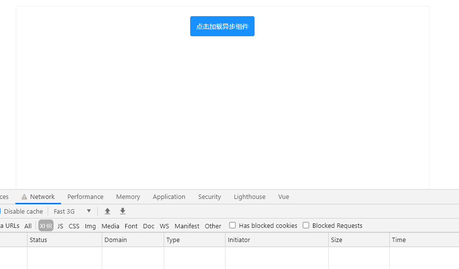
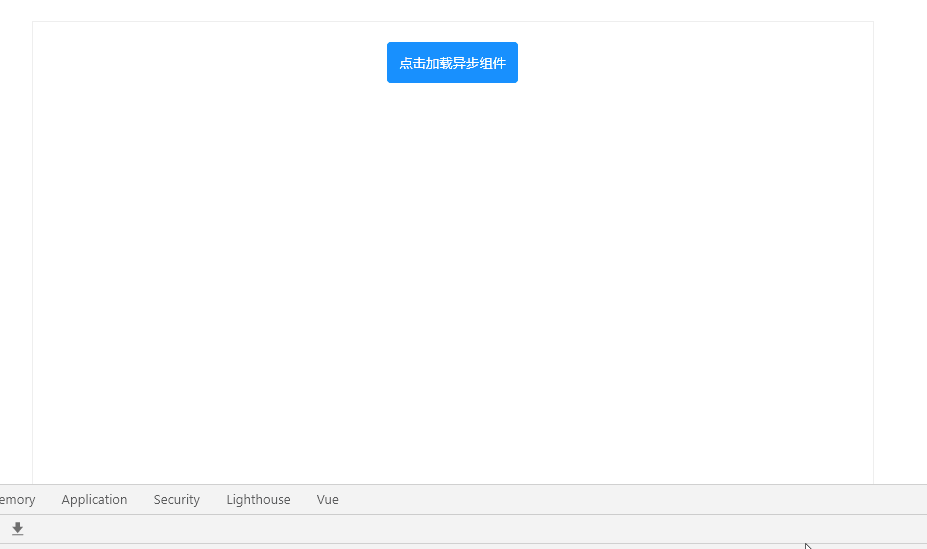
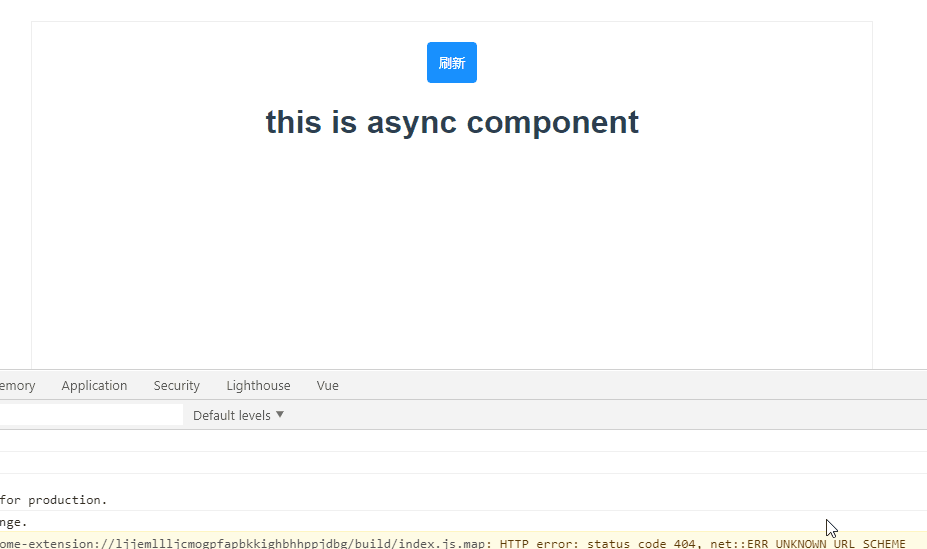

# vue3 的 Suspense


## 概述
`Suspense` 是 vue3 中新增的组件，类似于 `keep-alive` 不需要任何的引入，可以直接进行使用。自带两个 `slot` 分别为 `default、fallback`。顾名思义，当要加载的组件不满足状态时,`Suspense` 将回退到 `fallback`状态一直到加载的组件满足条件，才会进行渲染。

## 使用场景

### 异步组件
最为常见的使用场景，配合 vue3 中 `defineAsyncComponent` 来加载异步组件时，进行 loading 的处理。如下

```html
<template>
  <button @click="loadAsyncComponent">点击加载异步组件</button>
  <Suspense v-if="loadAsync">
    <template #default>
      <AsyncComponent></AsyncComponent>
    </template>
    <template #fallback>
      <div class="loading"></div>
    </template>
  </Suspense>
</template>

<script>
import { defineAsyncComponent } from "vue";
export default {
  name: "App",
  data() {
    return {
      loadAsync: false
    };
  },
  components: {
    HelloWorld,
    AsyncComponent: defineAsyncComponent(() => {
      return import("./components/async-component.vue");
    })
  },
  methods: {
    loadAsyncComponent() {
      this.loadAsync = true;
    }
  }
};
</script>

<style lang="scss">
#app {
  width: 800px;
  height: 600px;
  padding: 20px;
  margin: 0 auto;
  border: 1px solid #eeeeee;
  font-family: Avenir, Helvetica, Arial, sans-serif;
  -webkit-font-smoothing: antialiased;
  -moz-osx-font-smoothing: grayscale;
  text-align: center;
  color: #2c3e50;
  position: relative;
}
button {
  padding: 12px 12px;
  background-color: #1890ff;
  outline: none;
  border: none;
  border-radius: 4px;
  color: #fff;
  cursor: pointer;
}
.loading {
  position: absolute;
  width: 36px;
  height: 36px;
  top: 50%;
  left: 50%;
  margin: -18px 0 0 -18px;
  background-image: url("./assets/images/Loading.png");
  background-size: 100%;
  animation: rotate 1.4s linear infinite;
}
@keyframes rotate {
  from {
    transform: rotate(0);
  }
  to {
    transform: rotate(360deg);
  }
}
</style>
```
```html
<template>
  <h1>this is async component</h1>
</template>

<script>
export default {
  name: "AsyncComponent",
};
</script>
```
因为我们的 `async-compoent` 很小，因此将 network 调为 3g 之后才能看到很明显的效果。如下：




### 配合 Composition API 中的 setup 

很多时候，我们子组件的数据加载完成之前都需要显示 `loading` 效果。vue3 中的 `Composition API` 中的 `setup` 同样为我们提供了方便。

更改 `async-compoent` 如下:

```html
<template>
  <h1>this is async component</h1>
</template>

<script>
// import { sleep } from "../util/index";
const sleep = time => {
  return new Promise((reslove, reject) => {
    setTimeout(() => {
      reslove();
    }, time);
  });
};

export default {
  name: "AsyncComponent",
  async setup() {
    // ... some code 将初始化页面需要的数据放在此处，
    await sleep(3000); //模拟数据请求
  }
};
</script>
```



### 配合路由使用
最为方便的是配合路由使用,当未加载完毕时不显示 `router-view`，而是渲染 `fallback`的 内容，全局增加 loading 的处理：
```html
<router-link to="/home">Home</router-link>|
<router-link to="/about">About</router-link>
<Suspense>
  <template #default>
    <router-view />
  </template>
  <template #fallback>
    <div class="loading"></div>
  </template>
</Suspense>
```
具体效果：


## 错误处理
在上面的处理中，加入在请求数据或者加载组件时发生了错误，那么如何进行错误的处理呢？ vue3 中的钩子函数 `errorCapture` 同样为我们提供了方便。
更改 app.vue 如下
```html
<template>
  <button @click="reload">刷新</button>
  <h1 v-if="error">load async component error</h1>
  <Suspense v-else>
    <template #default>
      <AsyncComponent></AsyncComponent>
    </template>
    <template #fallback>
      <div class="loading"></div>
    </template>
  </Suspense>
</template>

<script>
import HelloWorld from "./components/HelloWorld.vue";
import { ref, defineAsyncComponent, onErrorCaptured } from "vue";
export default {
  name: "App",
  setup() {
    const error = ref(null);
    onErrorCaptured(e => {
      error.value = e;
      return false;
    });
    return { error };
  },
  data() {
    return {
      loadAsync: false
    };
  },
  components: {
    HelloWorld,
    AsyncComponent: defineAsyncComponent(() => {
      return import("./components/async-component.vue");
    })
  },
  methods: {
    loadAsyncComponent() {
      this.loadAsync = true;
    },
    reload(){
      window.location.reload()
    }
  }
};
```
更改  `async-compoent` 如下:
```html
<script>
export default {
  name: "AsyncComponent",
  async setup() {
    // ... some code 将初始化页面需要的数据放在此处，
    if (Math.random() > 0.5) {
      await sleep(1000); //模拟数据请求
    } else {
      throw new Error("error message");
    }
  }
};
</script>
```




**代码**


